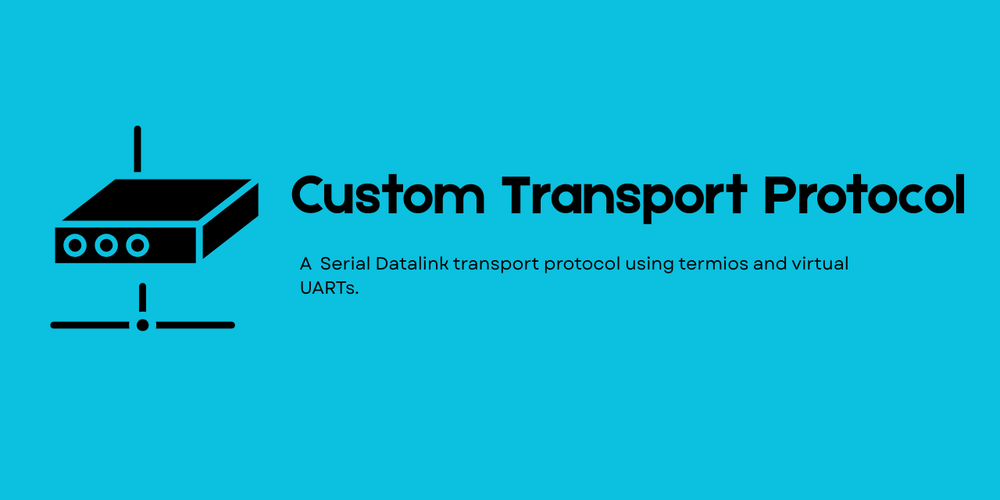
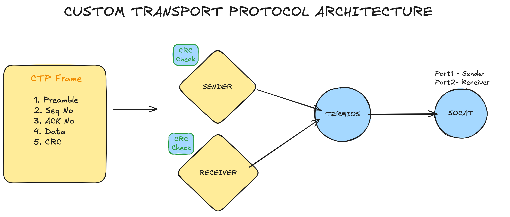

# **CTP — Custom Transport Protocol**



---

**CTP**, is a frame-based **custom transport protocol** implemented in pure C. This project simulates **reliable serial communication** over virtual or real serial ports, including frame creation, CRC error detection, and ACK/NACK based retransmission.

---

## 🌟 Features

| Protocol Feature              | CAP Implementation                               |
|-------------------------------|-------------------------------------------------|
| Frame Structure               | Each frame has preamble, sequence number, payload, and CRC |
| CRC Error Detection           | Detects transmission errors using binary CRC   |
| ACK/NACK Reliability          | Receiver sends ACK/NACK; sender retransmits if needed |
| Virtual Serial Communication  | Uses `socat` to simulate connected serial ports |
| Termios Integration           | Configures serial ports, baud rate, character size, and blocking mode |
| Simple Data Transfer          | Send arbitrary payloads reliably over serial   |


Serial ports - A: 3000 B: 5000
---

## 🚀 Getting Started

### Requirements
- GCC / C compiler  
- Unix-based OS (Linux, macOS)  
- `socat` (for virtual serial port testing)  
- `make`  

---

## 🔧 Build

```bash
cd ctp
socat -d -d pty,raw,echo=0,link=/tmp/sender pty,raw,echo=0,link=/tmp/receiver
make
make run-receiver
make run-sender
```

## CTP Architecture




## Readmore here: [CTP Blog](https://meerthika.medium.com/building-a-frame-based-custom-transport-protocol-in-c-2c9fbd404428)

## 🤝 Contributing

We ❤️ contributors!

To contribute:

1. Fork the repository.
2. Clone it locally:
   ```bash
   git clone [repo]
   cd ctp
   git checkout -b feature/my-improvement
   ```
## License
@Meerthika
